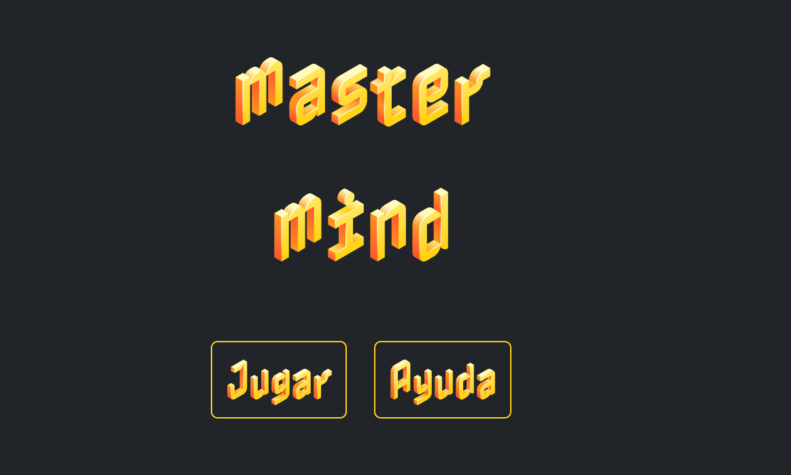

# Juego Mastermind

### Tabla de contenidos 

- ¿Qué es?
- Desarrollo y tecnologías usadas
- ¿Cómo jugar?
- Errores conocidos 
- Créditos y Licencia

 
*Puedes ver el proyecto* [*aquí.*](https://akireorl.github.io/Proyecto3Bootcamp/)

     

---

### ¿Qué es? 

El siguiente proyecto se trata de una versión online del juego de mesa Mastermind, creado en un ámbito educativo para GeeksHubs Academy. 

---
### Desarrollo

Este proyecto se ha desarrollado con HTML5, CSS3, BootStrap y JavaScript. 
El JavaScript ha supuesto un verdadero reto al trabajar con el almacenaje de sesión, sobre todo, en lo referente a la toma de colores y su posterior uso en la lógica del juego.

---
### ¿Cómo jugar?

Mastermind es un juego de ingenio en el que tendremos que adivinar la combinación de 4 colores ganadora. Para empezar a jugar iremos a la página de inicio donde vemos dos botones, el primero será para iniciar una nueva partida y el segundo para conocer las reglas del juego. Los pasos a seguir para jugar son los siguientes: 

Primero introduce tu nombre, aunque si nos saltamos esta parte el juego te llamará Jugador 1 por defecto.

Elige el nivel de dificultad jugaremos con 4 colores y tendremos 10 intentos.

En la siguiente pantalla elegiremos los colores con los que queremos jugar. Clicaremos en los cuadrados negros y gracias a un color picker podremos elegir una gran variedad de colores. Una vez elegidos clicaremos el botón de "Jugar" para ir a la pantalla del tablero.

En esta pantalla veremos nuestros colores. Clicaremos en estos  y luego en el cuadrado que elijamos papara empezar nuestra primera combinación y los cuadrados del tablero se irán pintando por orden. Si nos equivocamos podremos borrar los colores clicando en "remove". Una vez decidida la combinación que creamos ser la ganadora clicaremos en "check".

En caso de no haber introducido la combinación correcta nos aparecerá un mensaje invitándonos a intentarlo de nuevo y al presionar “aceptar” podremos ver si hemos acertado la posición de algún color en los circulitos que se pondrán en blanco.

Para un nuevo intento, realizamos los pasos anteriores.
Ganaremos cuando adivinemos la combinación secreta, es decir cuando los cuatro círculos sean blancos. Por el contrario, habremos perdido si nos quedamos sin intentos.

---
### Errores conocidos

Podría considerarse un fallo que los circulitos blancos no aparezcan hasta que no aceptas el Alert, pero al marcarse después de aceptar queda la referencia en  pantalla para que puedas avanzar en el juego.

---

---
---
---
